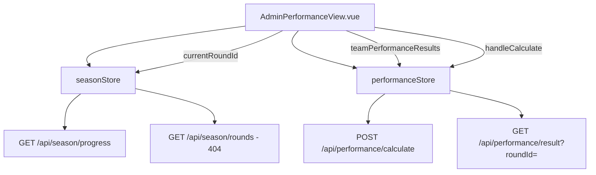

## 产品概述

修复公演结算中心的两个核心问题：1) 页面显示异常（因 `currentRoundId` 为空导致数据无法加载）；2) 无法开始结算（结算按钮被禁用）。

## 核心问题

1. `GET /api/season/rounds` 后端返回 404，导致 `seasonStore.rounds` 为空数组
2. `AdminPerformanceView.vue` 中 `currentRoundId` 的计算依赖 `rounds` 列表，当 `rounds` 为空且 fallback 条件不满足时返回空字符串
3. 结算按钮 `:disabled="hasCalculated || !currentRoundId"` 在 `currentRoundId` 为空时被禁用
4. `performanceStore.fetchAdminPerformanceResults` 使用自定义 Header `X-Round-Id` 传递参数，后端可能不支持
5. `performanceStore.fetchPlayerPerformanceResults` 同样使用 `X-Round-Id` Header

## 修复目标

- 确保 `currentRoundId` 在各种情况下都能正确计算，不依赖 `rounds` API
- 修改 `fetchAdminPerformanceResults` 和 `fetchPlayerPerformanceResults`，改用 URL 查询参数传递 `roundId`
- 为后端开发者提供公演结算相关接口的完整规范说明

## 技术栈

- 前端框架：Vue 3 + TypeScript + Pinia + TDesign
- 后端：Node.js（用户已有独立后端项目）
- API 通信：`doRequest` 封装（`src/services/api.ts`）

## 实现方案

### 问题1：`currentRoundId` 计算修复

**现状**：`AdminPerformanceView.vue` 的 `currentRoundId` 计算属性依赖 `seasonStore.rounds` 数组，当 `GET /api/season/rounds` 404 时 `rounds` 为空，导致 `currentRoundId` 返回空字符串。

**修复策略**：增强 `currentRoundId` 的 fallback 链，不依赖 `rounds` API。可利用 `seasonStore` 中已有的 `currentRoundId` 和 `currentRoundNumber` 状态（来自 `GET /api/season` 或 `GET /api/season/progress`，这两个接口后端已实现）。

**修改文件**：`src/views/admin/AdminPerformanceView.vue` 的 `currentRoundId` computed 属性。

### 问题2：API 调用方式修复

**现状**：`performanceStore.fetchAdminPerformanceResults` 和 `fetchPlayerPerformanceResults` 使用自定义 Header `X-Round-Id` 传递 `roundId`，后端通常不从自定义 Header 读取参数。

**修复策略**：改为 URL 查询参数 `?roundId=xxx` 方式传递。

**修改文件**：`src/stores/performanceStore.ts` 中的 `fetchAdminPerformanceResults` 和 `fetchPlayerPerformanceResults` 方法。

### 问题3：后端接口规范说明

为后端开发者提供公演结算模块所有接口的完整规范，包括请求格式、响应格式、业务逻辑说明。

## 实现细节

### 修改1：`currentRoundId` 计算链增强

在 `AdminPerformanceView.vue` 中，将 `currentRoundId` 的 computed 改为更强健的 fallback：

```
fallback 链：
1. 从 rounds 列表中匹配当前 roundNumber → 找到则返回 round.id
2. seasonStore.currentRoundId 已有值 → 直接返回
3. 通过 seasonStore.fetchSeason() 获取赛季信息后，用 currentRoundIndex 构造一个临时 ID
```

### 修改2：API 调用方式

`performanceStore.ts` 中：

- `fetchAdminPerformanceResults(roundId)`：`doRequest('/performance/result?roundId=' + roundId, { method: 'GET' })`
- `fetchPlayerPerformanceResults(roundId)`：`doRequest('/player/performance/result?roundId=' + roundId, { method: 'GET' })`

### 后端接口规范

需要提供给后端开发者的接口列表：

1. `POST /api/performance/calculate` - 执行公演结算
2. `GET /api/performance/result?roundId=xxx` - 获取公演结算结果
3. `GET /api/player/performance/result?roundId=xxx` - 选手端获取结算结果
4. `POST /api/performance/generate-audience-vote` - 生成大众评审投票
5. `GET /api/performance/audience-ranking?roundId=xxx` - 获取喜爱度排名
6. `GET /api/season/rounds` - 获取轮次列表（当前 404，需要后端实现）

## 架构设计

### 数据流



### 关键修改点

| 文件 | 修改内容 |
| --- | --- |
| `src/views/admin/AdminPerformanceView.vue` | 增强 `currentRoundId` computed 的 fallback 逻辑 |
| `src/stores/performanceStore.ts` | `fetchAdminPerformanceResults` 和 `fetchPlayerPerformanceResults` 改为 URL 查询参数 |
| 后端接口规范文档 | 提供给后端开发者的接口说明 |


## 目录结构

```
修改文件：
- src/views/admin/AdminPerformanceView.vue  [MODIFY] 修复 currentRoundId 计算
- src/stores/performanceStore.ts          [MODIFY] 修复 API 调用方式（X-Round-Id → URL 参数）
- 后端接口规范.md                        [NEW] 提供给后端开发者的接口说明文档
```